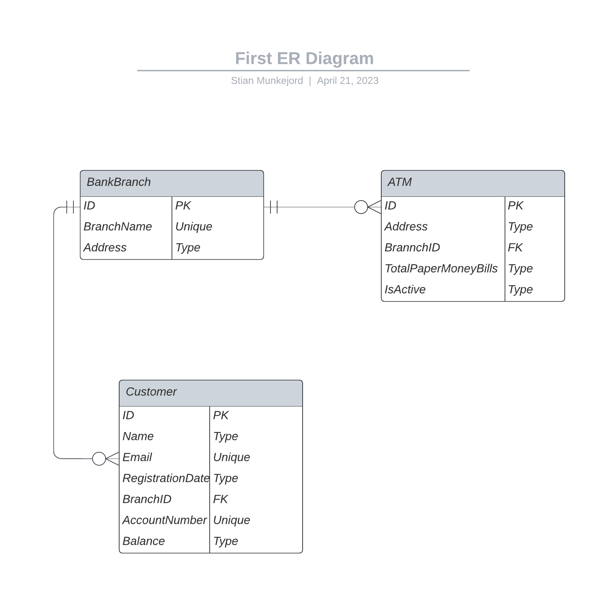
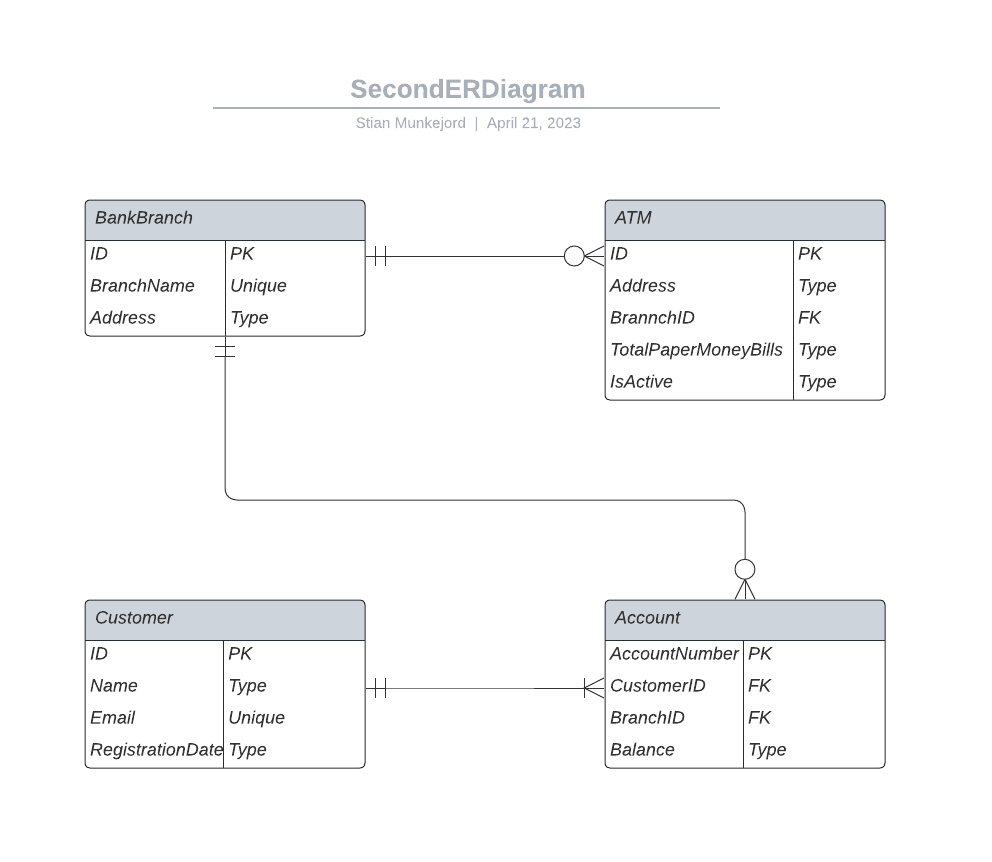

# Problem 1

# Problem 2

### Problem with the current design:
The current design does not support multiple accounts for a single customer, either in the same branch or across different branches. The Customer entity has a direct one-to-one relationship with a unique account number and balance, preventing the possibility of having multiple accounts.

### Solution:
To support multiple accounts for a customer, we need to create a new table (entity) called Account. This will allow customers to have several accounts in different branches or even within the same branch.

# Problem 3

## First Normal Form (1NF):
1NF requires that each column in a table contains atomic values and that there are no repeating groups or arrays. To achieve 1NF, we should separate the combined operation data into separate columns.

### Transactions Table (1NF):

    TransactionID (Primary Key)
    CustomerID (Foreign Key)
    ATMID (Foreign Key)
    WithdrawnAmount
    TransactionDate

## Second Normal Form (2NF):
2NF requires that a table is in 1NF and every non-primary key attribute is fully functionally dependent on the primary key. Since all non-primary key attributes in the Transactions table are dependent on the primary key (TransactionID), the table is already in 2NF.

## Third Normal Form (3NF):
3NF requires that a table is in 2NF and there are no transitive dependencies between non-primary key attributes. In the Transactions table, there are no transitive dependencies, so the table is already in 3NF.

## Boyce-Codd Normal Form (BCNF):
BCNF requires that a table is in 3NF and every determinant is a candidate key. A determinant is an attribute or a set of attributes that determine the value of another attribute. Since there are no such determinants in the Transactions table, it is already in BCNF.

To summarize, the Transactions table is already in 1NF, 2NF, 3NF, and BCNF after splitting the combined operation data into separate columns:

| TransactionID | CustomerID | ATMID | WithdrawnAmount | TransactionDate |
|-|-|-|-|-|
| 1 | 130 | 12 | 500 | 02-08-2022 |
| 2 | 130 | 12 | 1000 | 12-08-2022 |
| 3 | 130 | 16 | 400 | 10-09-2022 |
| 4 | 988 | 12 | 350 | 18-08-2022 |
| 5 | 988 | 16 | 2000 | 20-09-2022 |
| 6 | 988 | 23 | 300 | 14-12-2022 |
| 7 | 756 | 2 | 700 | 17-07-2022 |
| 8 | 756 | 16 | 1500 | 20-08-2022 |
| 9 | 756 | 19 | 400 | 14-12-2022 |
| 10 | 491 | 3 | 200 | 18-07-2022 |
| 11 | 491 | 18 | 1500 | 21-09-2022 |
| 12 | 491 | 2 | 600 | 16-12-2022 |

## Assumptions:
When normalizing this table for all the tasks, i asusme that the bank only have atms in Norway containing only NOK, which means the WithdrawnAmount will always be NOK. Another assumption is that the atm is used as it is in real life, you can go to any, tak out whenever, and a preferd amount. With this we need the transactionID column to veryfi that there will not be dublicates of transaction data, and follows 1NF, which is possible without the TransactionID