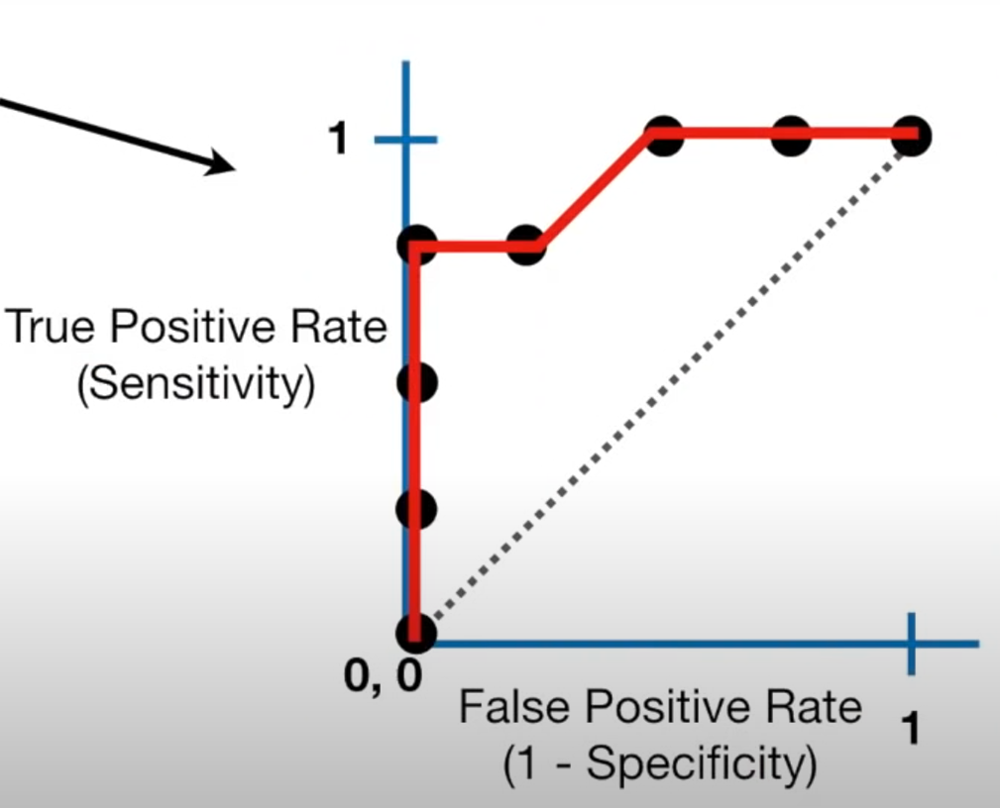

# Notater fra StatQuest

## Confusion matrix

This is an example of a 2x2 confusion matric
The values on the top are values that are true, while the values on the side is the value that that is predicted

|                  | Has obesity     | Has not obesity |
| ---------------- | --------------- | --------------- |
| Has obesity      | True Positives  | False Positives |
| Has not obersity | False Negatives | True Negatives  |

## Sensitivity

Calculating sensitivity goes as follows:

$$ 
Sensitivity = {True Positives \over 
True Positives + False negatives}
$$

With the example in the 2x2 matrix above, the sensetivity tells us what percentage of patients with hearth disease where correctly indentified

## Specificity

Calculating specificity goes as follows:

$$
Specificity = {True Negatives \over
True Negatives + False Positives}
$$

With the example in the 2x2 matrix above, the specificity tells us what percentage of patients without hearth disease where correctly indentified

## Sensitivity and Specifisity

If correctly identifying *positives* is the most important thing to do with the data, we should choose a method with higher **Sensitivity**

If correctly identifying *negatives* is more important, then we should put more emphasis on **Specificity**

## Sensitivity and Specifisity on bigger matrixes

If there are three ore more collumns/rows in the confusion matrix, we need to calculate both Sensitivity and Specifisity for each category.

## Linear Regression (Least Squares)

Linear regression fits a **Straight Line** to the training set

The **Straight Line** doesn't have the fexibility to accurately replicate the arc in the "true" reationship

The inability for a machine learning method (like linear regression) to capture the true relationship is called **bias**. Beacuse it can't be curved like the "true" relationship, it has a relatively large amount of bias.

## Squiggly Line

The **Squiggly Line** is super flexible and hugs the training set along the arc of the true relationship.

Because the **Squiggly Line** can handle the arc in the true relationship, it has very little **bias**.

## Diffrence between Straight Line and Squiggly Line

We can compare how well the **Straight Line** and the **Squiggly Line** fit the data by calculating their sums of squares. In other words, we measure the distance from the lines to the data, and add them up.

When using the training set the **Squiggly Line** does very well. However this may not be the case when using the testing set. The difference in fits between sets is called **Variance**.

The **Squiggly Line** has **low bias**, since it is felxible and can adapt to the curve in the relationship, but the **Squiggly Line** has **High variability**, because it results in vastly diffrent Sums of Squares of diffrent datasets.  

In contrast, the **Straight Line** has relatively **high bias**, since it can not capture the curve in the relationship, but it has relatively **low variance**, beacuse the Sums of Squares are very similar to the diffrent datasets.

So to summerize, the **Straight Line** might only give good preditions, and not great preditions. But they will be consistently good preditions.

Since the **Squiggly Line** fits the trainingset really well, but not the testing set, we say the Squiggly Line is **Overfit**

In machine learning, the ideal algorithm has **low bias** and can accurately model the true relationship, and it has **low variability**, by producing consistent predictions across diffrent datasets.

Three commonly used methods for finding the sweet spot between simple and complicated models are: **regularization**, **bosting** and **bagging**.

# ROC (Receiver Operator Characteristics)

The **ROC** graph summarizes all of the confusion matrices that each treshold produced in a logistic regression alogrythm.

# AUC (Area Under the Curve)

We can calcualte the area under the curve (**AUC**). When doing this we can compare the **ROC** of diffrent ML. algorythms.

The **ROC** with the highest value **AUC** is the optimal MLA. to use

### Side note
Although **ROC** graphs are drawn using **True Positive Rates** and **False Positive Rates** to summarize confusion matrices, there are other metrics that attempt to do the same thing.

For example, people often replace the **False Positive Rate** with **Precision**.

# Precission

To calculate the precission you use the following formula:

$$
Precision = {True Positives \over
True Positives + False Positives}
$$

**Precision** is the proportion of positive results that were correctly classified

If there are where a considerable more amount in one direction, which create an unbalanced graph, then **Precision** might be more useful than **False Positive Rate**

This is because **Precision** does not inclued the number of **True Negatives** in its calculation, and is not effected by the imbalance.

*(e.g: When studying a rare disease)*

